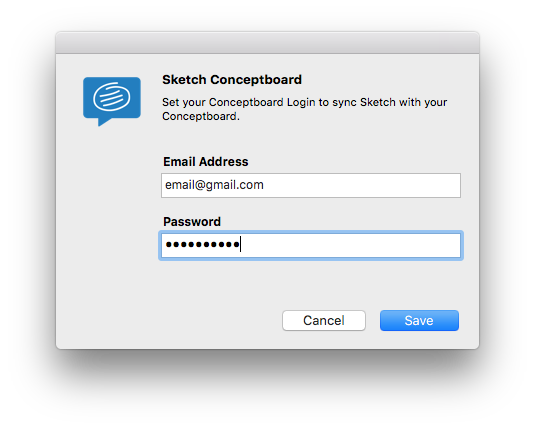
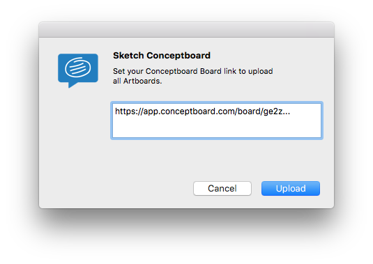

# Conceptboard
Sketch Plugin to automagically upload all your artboards to Conceptboard. The plugin keeps your pages order and your artboard position and size.

## Features

- [x] Add dedicated Conceptboard Settings panel
- [x] Ask for Conceptboard before upload
- [x] Save info into Sketch App (account) or into Sketch file (board)
- [x] Upload only the current page or all pages
- [x] Skip `Symbols` page during upload (and properly marked pages)
- [ ] Choose pages to be uploaded
- [ ] Show progress during upload

## How to use

**Conceptboard Menu**

You can choose to upload all your pages or only the current page. If you choose to upload all your pages, the Conceptboard Plugin will skip `Symbols` page and all other pages starting with `_ (underscore)`.

**Settings**

First of all you need to add your Conceptboard Account to Sketch, use your `username` and `password`. Your account is saved into Sketch and will be used in all your Sketches.

**Board**

The only step you need to do before upload your Sketch file to Conceptboard is to specify the destionation Board Link. The board link is saved in your Sketch file, so you don't need to add it anytime.

